# A2 Report

Author: Andrew Yoon 

Date: 10/2/2023 

Check [readme.txt](readme.txt) for course work statement and self-evaluation. 
  
## Q1 Graphics pipeline (description)

### Q1.1 Coordinate systems & transformations

In the graphics pipeline, objects begin in their own local or object coordinate system. Through transformations, they're placed into a context. Next, a viewing transformation adjusts the scene as if viewed from a virtual camera, transitioning objects to view or eye coordinates. Projection transformation then translates the 3D scene onto a 2D plane, either maintaining sizes or introducing perspective. This results in clip coordinates. Finally, a view transformation scales and translates these coordinates to screen coordinates suitable for display.

### Q1.2 Primitives

Primitives are the basic building blocks or units in computer graphics, like vertex, lines, and polygons. Graphics objects, on the other hand, are complex structures or entities made up of these primitives. In essence, while primitives are the basic elements, graphics objects are assemblies or combinations of these elements. Primitives can be rendered by the GPU and compose models. 

### Q1.3 Scan conversion

A scan conversion algorithm translates graphics primitives into a set of pixels on the screen. It is the last step of graphics pipeline. Determines which pixels should be illuminated to best represent the shape of the primitive to render 2D primitives to frame buffer.

### Q1.4 Hand-on Bresenham algorithm

Copy the question and write your answer here.
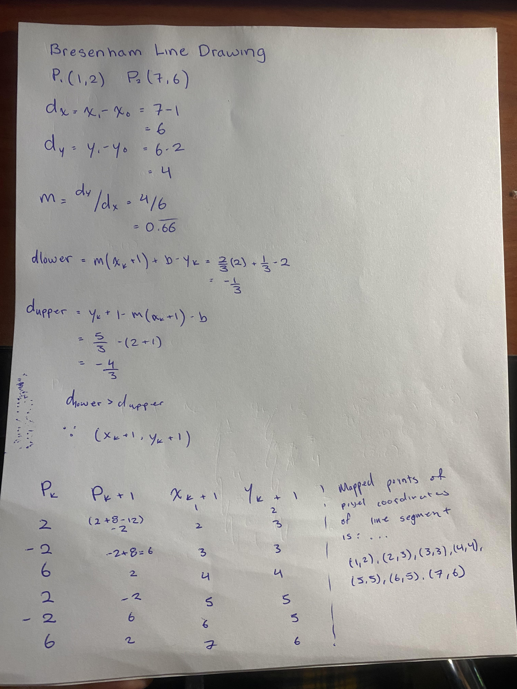{width=30%}

## Q2 OpenGL and Glut (lab practice)

### Q2.1 OpenGL primitives 

Complete? (Yes) or No 

If you answer Yes, insert a screen shot image to show the completion.

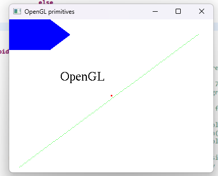{width=30%}

If No,  add a short description to describe the issues encountered.

### Q2.2 Interactive graphics 

Complete? (Yes) or No 

If you answer Yes, insert a screen shot image to show the completion.

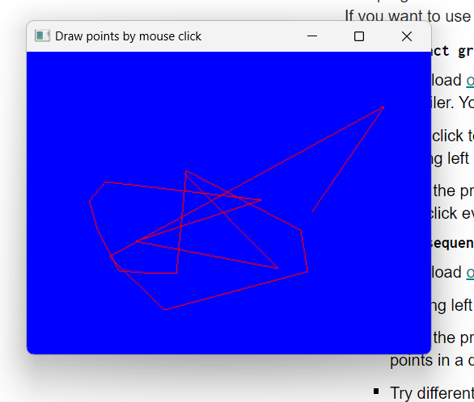{width=30%}

If No,  add a short description to describe the issues encountered.

### Q2.3 Bitmap file I/O 

Complete? (Yes) or No 

If you answer Yes, insert a screen shot image to show the completion.

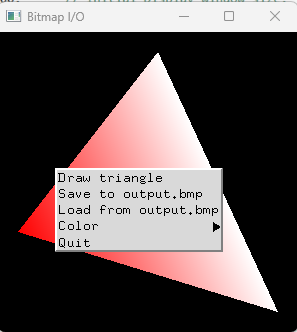{width=30%}

If No,  add a short description to describe the issues encountered.

## Q3 SimpleDraw (programming)

### Q3.1 Display window and menu

Complete? (Yes) or No 

If you answer Yes, insert a screen shot image to show the completion.

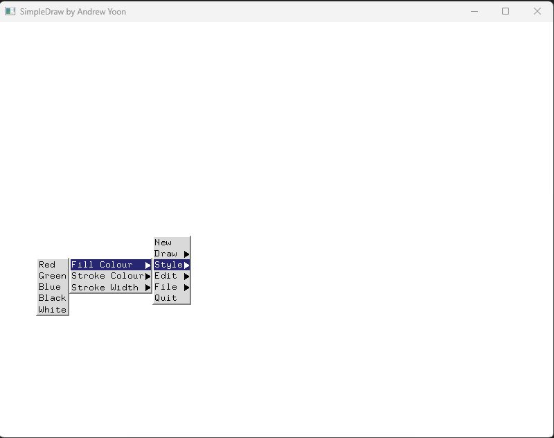{width=30%}

If No,  add a short description to describe the issues encountered.

### Q3.2 Data structures

Complete? (Yes) or No 

If you answer Yes, insert a screen shot image to show the completion.

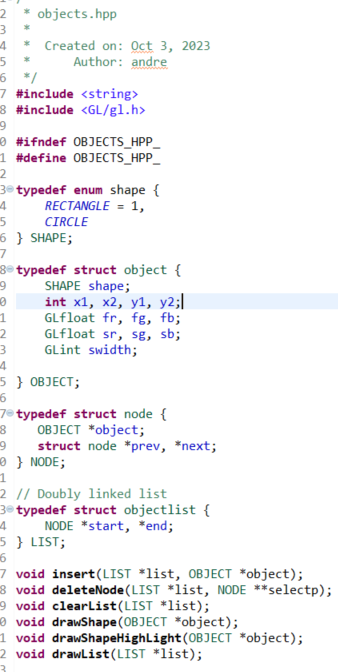{width=30%}

If No,  add a short description to describe the issues encountered.

### Q3.3 Draw rectangles

Complete? (Yes) or No 

If you answer Yes, insert a screen shot image to show the completion.

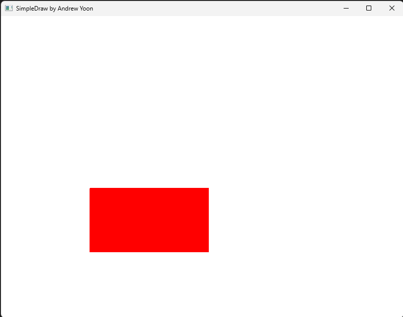{width=30%}

If No,  add a short description to describe the issues encountered.

### Q3.4 Draw circles

Complete? (Yes) or No 

If you answer Yes, insert a screen shot image to show the completion.

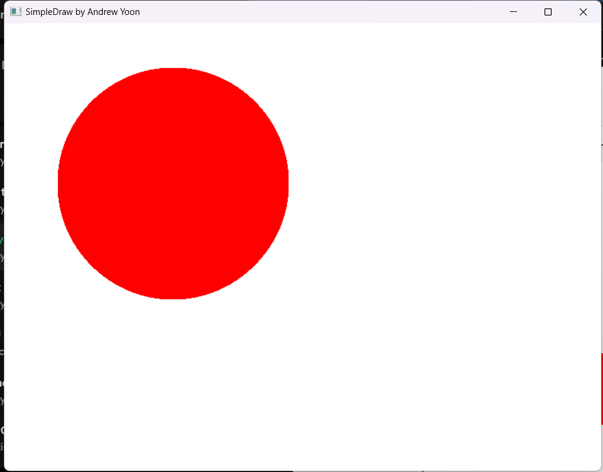{width=90%}

If No,  add a short description to describe the issues encountered.

### Q3.5 Edit features

Complete? (Yes) or No 

If you answer Yes, insert a screen shot image to show the completion.

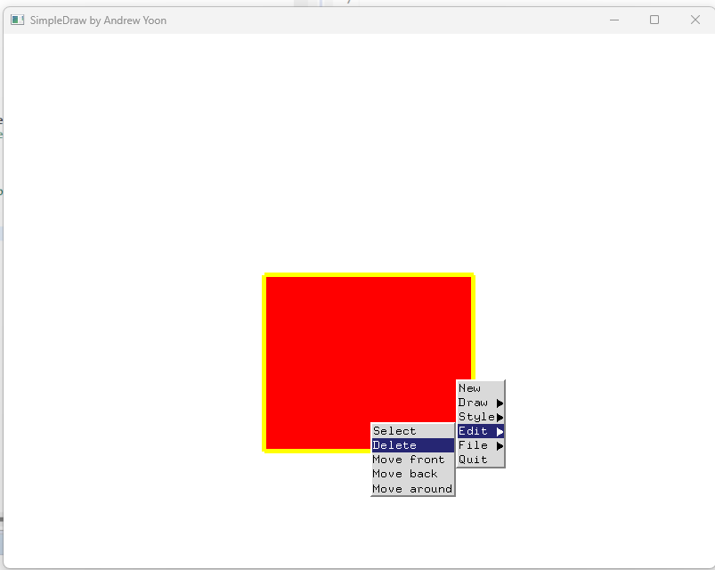{width=90%}

If No,  add a short description to describe the issues encountered.

### Q3.6 Save/Open SVG files

Complete? Yes or No

If you answer Yes, link the image
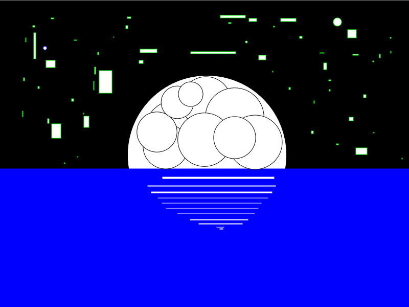.

### Q3.7 Export to bitmap

Complete? Yes or No

If you answer Yes, link the image
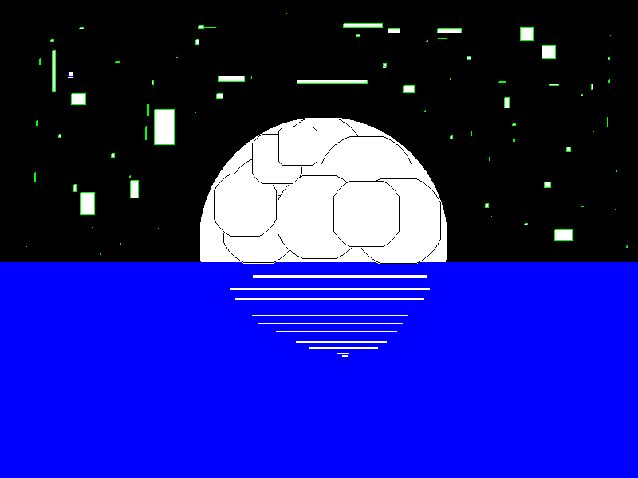.

### Q3.8 Circle&Square artwork

Complete? Yes or No

If you answer Yes, link the images
[C&S artwork in SVG](images/c&s.svg)
.

**References**

1. CP411 a2
2. Add your references if you used any. 
