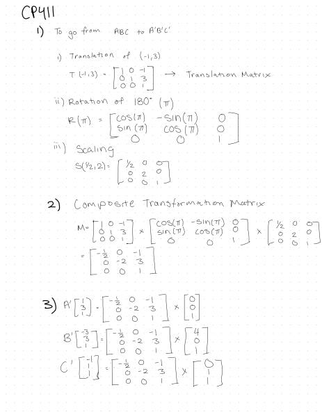
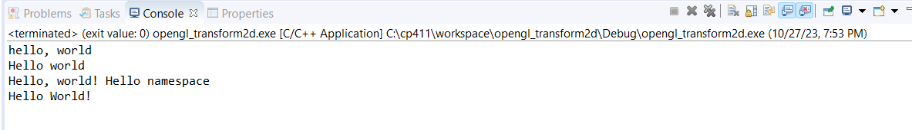
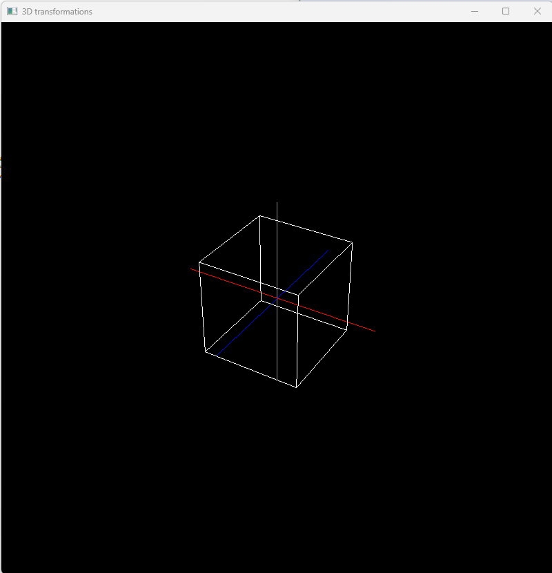
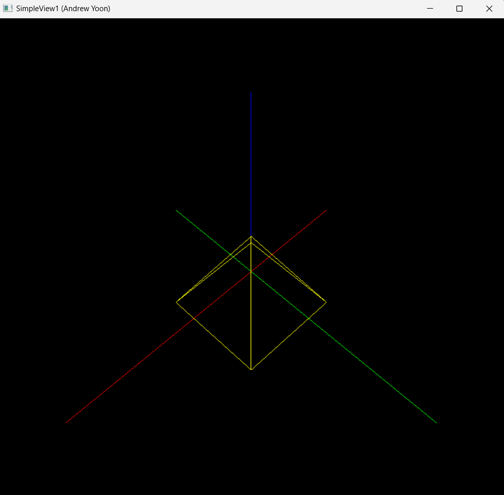
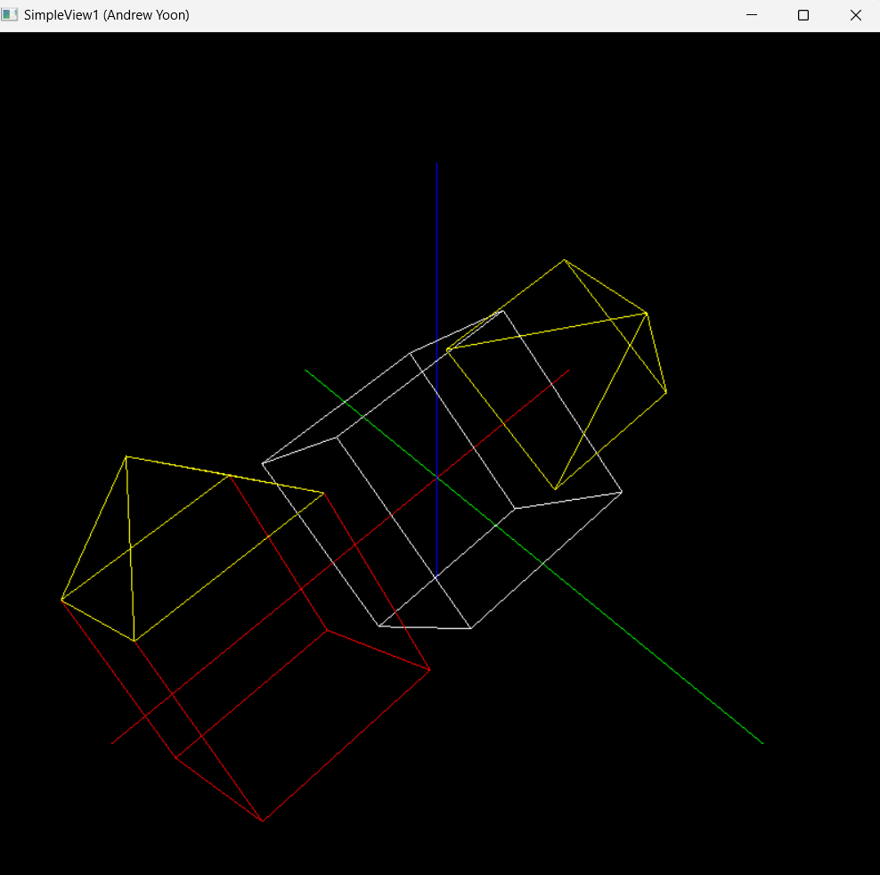
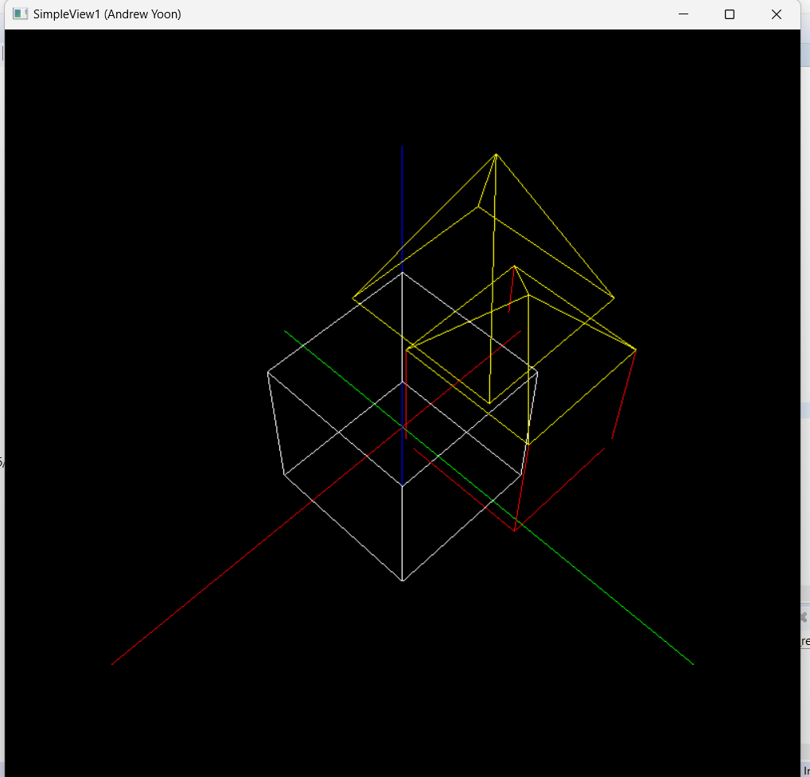

# A3 Report

Author: Andrew Yoon 

Date: 10/23/2023 

Check [readme.txt](readme.txt) for course work statement and self-evaluation. 
  
## Q1 Graphics transformations (short_answer)

### Q1.1 Principle of transformations
1. The 3 basic transformations are translations, rotations and scaling.
2. A composite transformation is a combined sequence of transformations. Two or more transformations are performed on a figure to produce a new figure. 
3. Homogeneous coordinates allows for operations like translation, rotation, scaling, and perspective projection transformations to be represented with matrix multiplication. Simplifying the computation and integration of these transformations.

### Q1.2 Hand on 2D transformations

{width=90%}

## Q2 Graphics transformation programming (lab practice)

### Q2.1 Warm up C++ 
Complete? ((Yes)/No) 

If Yes, insert a screen shot image to show the completion.

{width=90%}

If No,  Add a short description to describe the issues encountered.

### Q2.2 2D transformations 
Complete? ((Yes)/No) 

If Yes, insert a screen shot image to show the completion.

{width=90%}

If No,  Add a short description to describe the issues encountered.

### Q2.3 3D object and transformations 
Complete? ((Yes)/No) 

If Yes, insert a screen shot image to show the completion.

{width=90%}

If No,  Add a short description to describe the issues encountered.

### Q2.4 Mesh object model 
Complete? ((Yes)/No) 

If Yes, insert a screen shot image to show the completion.

{width=90%}

If No,  Add a short description to describe the issues encountered.

## Q3 SimpleView1 - transformations (programming)

### Q3.1 Create and render cube objects 

Complete? ((Yes)/No) 

If Yes, insert a screen shot image to show the completion.

{width=90%}

If No, add a short description to describe the issues encountered.

### Q3.2 Create and render the pyramid object 

Complete? ((Yes)/No) 

If Yes, insert a screen shot image to show the completion.

{width=90%}

If No, add a short description to describe the issues encountered.

### Q3.3 Create and render the house object 

Complete? ((Yes)/No) 

If Yes, insert a screen shot image to show the completion.

{width=90%}

If No, add a short description to describe the issues encountered.

### Q3.4 MCS transforms 

Complete?    ((Yes)/No) 

If Yes, insert a screen shot image to show the completion.

{width=90%}

If No, add a short description to describe the issues encountered.

### Q3.5 WCS transforms 

Complete? ((Yes)/No) 

If Yes, insert a screen shot image to show the completion.

{width=90%}

If No, add a short description to describe the issues encountered.

### Q3.6 VCS transforms 

Complete? ((Yes)/No) 

If Yes, insert a screen shot image to show the completion.

{width=90%}

If No, add a short description to describe the issues encountered.

**References**

1. CP411 a3
2. Add your references if you used any. 

HBF - CP411 Course content code used in 3D Transformation Slides
      2D Transformations
